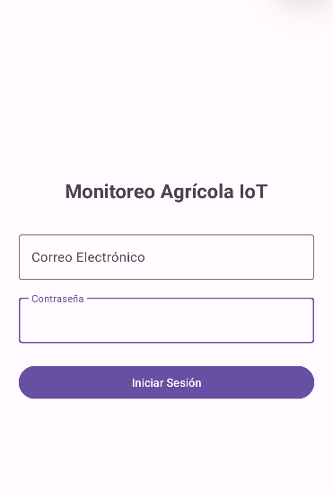
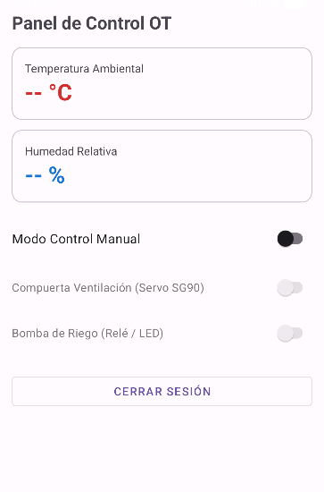

# IoTClimaRiego

Aplicacion movil Android para monitoreo climatico y gestion de riego automatizado en entornos agricolas e industriales OT. Desarrollada por vamp9.

## Arquitectura del Sistema

- **Cliente Movil:** Aplicacion nativa Android desarrollada en Kotlin con Material Components y ViewBinding.
- **Gateway OT:** Servidor intermedio alojado en Raspberry Pi (Raspbian OS) con servidor web Apache y scripts PHP (`cn.php`, `ingreso.php`).
- **Base de Datos Cloud:** Instancia relacional en AWS RDS (MySQL) para persistencia y auditoria de accesos de usuarios.
- **Telemetria en Tiempo Real:** Integracion con Firebase Realtime Database para monitoreo de sensores (temperatura y humedad) y control de actuadores (bomba de riego y compuerta de ventilacion).
- **Seguridad:** Cumplimiento de lineamientos ISO 27400 mediante control de acceso, aislamiento de credenciales maestras de base de datos en el gateway y uso de sentencias preparadas para prevenir inyecciones SQL.

## Mockups de la Interfaz

  
  &nbsp;&nbsp;&nbsp;&nbsp;
  

## Componentes y Tecnologias

- Android Studio
- Kotlin
- Android Volley
- Firebase Realtime Database
- Raspberry Pi (Raspbian OS)
- Apache HTTP Server y PHP
- AWS RDS MySQL
- MySQL Workbench
